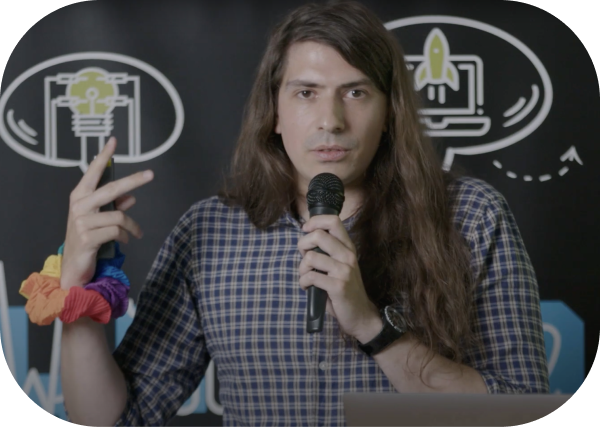

# Ciao, I'm Riccardo 🇮🇹 🇨🇱 🇵🇱 🏳️‍🌈

 

  <a href="https://odone.me/tir">
    <picture>
      <source srcset=".github/images/drop-light.svg" media="(prefers-color-scheme: dark)" />
      
    </picture>
  </a>

  <strong>88 mg/dl at 09:10 CET</strong>

   

  <a href="https://odone.me">
    <picture>
      <source srcset=".github/images/home-light.svg" media="(prefers-color-scheme: dark)" />
      
    </picture>
  </a>
  &nbsp; &nbsp;
  <a href="https://www.linkedin.com/in/riccardoodone">
    <picture>
      <source srcset=".github/images/linkedin-light.svg" media="(prefers-color-scheme: dark)" />
      
    </picture>
  </a>
  &nbsp; &nbsp;
  <a href="https://odone.me/tir">
    <picture>
      <source srcset=".github/images/youtube-light.svg" media="(prefers-color-scheme: dark)" />
      
    </picture>
  </a>

 
 

I’m a Software Engineer & Troublemaker. I explore problems on a whiteboard, find elegant solutions, and scale them with code.

  

## Coder 🧑‍💻

- [Ser](https://github.com/3v0k4/ser) — Ser(ve) your web app with HTTPS to any device on your network (mDNS).
- [HotDocs](https://github.com/3v0k4/hot_docs) — Write your docs with Ruby on Rails.
- [Degem](https://github.com/3v0k4/degem) — Find unused gems in a Ruby bundle.
- [exit.nvim](https://github.com/3v0k4/exit.nvim) — I solved how to exit Vim. exit.nvim prompts LLMs to write neovim commands.
- [Unpath](https://github.com/3v0k4/unpath) — Runs a command with a modified PATH that does not contain the given command(s)
- [Favicon Factory](https://github.com/3v0k4/favicon_factory) — Generates from an SVG the minimal set of icons needed by modern browsers.
- [TypeScript.tips](https://typescript.tips) — Make bugs impossible. One TypeScript tip at a time.
- [Rictionary](https://rictionary.odone.me) — My own personal Polish dictionary.
- [remark-lint-relative-markdown-file-path-links](https://github.com/3v0k4/remark-lint-relative-markdown-file-path-links) — remark-lint rule to warn when a link to another markdown document (md/mdx) is not a relative file path with extension.
- [remark-lint-docusaurus-empty-lines-around-admonition-content](https://github.com/3v0k4/remark-lint-docusaurus-empty-lines-around-admonition-content) — remark-lint rule to warn when an admonition does not have empty lines around its content.
- [What The Version aka WTV?](https://gist.github.com/3v0k4/3625f3922e3035811e937155fd635e55) — Version ranges in different languages: Ruby, JavaScript, Rust.
- [git amend-files](https://gist.github.com/3v0k4/06d1110b30ff7b05dcd3be372130a0e8)

## Karateka 🥋

- [Cake Machine Kata](https://github.com/3v0k4/cake-machine-kata) in concurrent Go
- [Stream Kata](https://github.com/3v0k4/stream-kata) in concurrent Go
- [TodoMPA](https://github.com/3v0k4/todo-mpa) — TodoMVC with 0 lines of JavaScript thanks to HTMX (and Go)
- [AOC 2023](https://github.com/3v0k4/aoc23) in Go
- [AOC 2022](https://github.com/3v0k4/aoc22) in Haskell & Go
- [AOC 2020](https://github.com/3v0k4/aoc20) in Rust
- [AOC 2019](https://github.com/3v0k4/aoc19) in Haskell
- AOC 2018 in PureScript — [Day 1](https://gist.github.com/3v0k4/53c950ca4e35c9e42516c40ac8b0c18d), [Day2](https://gist.github.com/3v0k4/453ff365e53bc276d4a6a7fb66f1771a), [Day 3](https://gist.github.com/3v0k4/4ddb1cb2d173f1343e25f4d9644551520), [Day 4](https://gist.github.com/3v0k4/3b8a4494c7e111fdf48a6b182d5ae5f7), [Day 5](https://gist.github.com/3v0k4/14d5b42640bc58a817bc6186de2b099a), [Day 6](https://gist.github.com/3v0k4/44160a29a1b83ed4ea4a038977f635f0), [Day 7](https://gist.github.com/3v0k4/11742f879ab0c51b30e451dae92faab6), [Day 8](https://gist.github.com/3v0k4/54ff8527a3c732fbce4cd49a929a9ee9), [Day 9](https://gist.github.com/3v0k4/57bf37be74bf7ffe9aa41c8e736e2f1a), [Day 10](https://gist.github.com/3v0k4/32076ae8fc4b005ca39fbabbfdeb4933)

## Contributor  🎉

- https://github.com/rails/importmap-rails/pull/305 in Ruby
- https://github.com/rails/importmap-rails/pull/298 in Ruby
- https://github.com/facebook/docusaurus/pull/11262 in Css
- https://github.com/rails/rails/pull/51746 in Ruby
- https://github.com/basecamp/kamal-site/pull/149 in Ruby
- https://github.com/basecamp/thruster/pull/29 in Go
- https://github.com/basecamp/thruster/pull/18 in Go
- https://github.com/basecamp/thruster/pull/13 in Go
- https://github.com/wspurgin/rspec-sidekiq/pull/219 in Ruby
- https://github.com/wspurgin/rspec-sidekiq/pull/216 in Ruby
- https://github.com/wspurgin/rspec-sidekiq/pull/215 in Ruby
- https://github.com/magicbell/magicbell-js/pull/13 in TypeScript
- https://github.com/facebook/docusaurus/pull/8445 in TypeScript
- https://github.com/yesodweb/yesod/pull/1619 in Haskell
- [Knapsack Pro](https://github.com/search?q=org%3AKnapsackPro+type%3Apr+author%3A3v0k4+&type=pullrequests) in Ruby & TypeScript
- [HabitatMap & AirCasting](https://github.com/search?q=org%3AHabitatMap+type%3Apr+author%3A3v0k4+&type=pullrequests) in Ruby & Elm & JavaScript

## Writer  ✍️

- [Blog](https://odone.me/)
- [PinkLetter](https://buttondown.email/riccardo.odone/archive)

## Co-Organizer  👏

- [Global Day of Coderetreat Kraków 2023/2022/2019](https://www.facebook.com/software.crafters.krakow)
- [SoCraTes Unconference 2019/2018](https://socrates-conf.de)

## Speaker  🎤

- [SoCraTes](https://www.socrates-conference.de/) — Just enough Python to beat Excel ([Jupyter Notebook](https://www.kaggle.com/code/riccardoodone/just-enough-python-to-beat-excel-socrates2024))
- [Future Conf](https://www.futureconf.tech/) — TypeFirst TypeScript
- [Tech Bytes by Ocado](https://www.meetup.com/tech-bytes-ocado-technology-krakow/events/293690403/) - Bugs don’t exist ([video](https://www.youtube.com/watch?v=7o182OnK-LY))
- [meet.js](https://www.meetup.com/krakowjs/events/292600643/) - TypeFirst TypeScript
- [YouTube channel](https://www.youtube.com/@riccardoodone)

## Diabetic 🩸

- [Debug your time in range](https://odone.me/tir) — The 6-week course for diabetic developers to increase TIR by 10%.
- [Dextop](https://getdextop.com/) — Real-time Dexcom blood sugars on your desktop.
- [Basal](https://basal.odone.me) — Let’s fine-tune your basal insulin.
