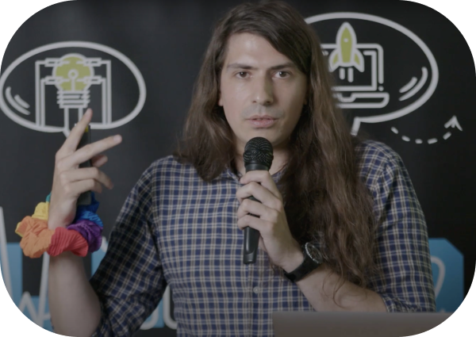

# Ciao, I'm Riccardo 🇮🇹 🇨🇱 🇵🇱 🏳️‍🌈

 

  <a href="https://odone.io/tir">
    <picture>
      <source srcset=".github/images/drop-light.svg" media="(prefers-color-scheme: dark)" />
      
    </picture>
  </a>

  <strong>113 mg/dl at 07:58 CET</strong>

   

  <a href="https://odone.io">
    <picture>
      <source srcset=".github/images/home-light.svg" media="(prefers-color-scheme: dark)" />
      
    </picture>
  </a>
  &nbsp; &nbsp;
  <a href="https://www.linkedin.com/in/riccardoodone">
    <picture>
      <source srcset=".github/images/linkedin-light.svg" media="(prefers-color-scheme: dark)" />
      
    </picture>
  </a>
  &nbsp; &nbsp;
  <a href="https://odone.io/tir">
    <picture>
      <source srcset=".github/images/youtube-light.svg" media="(prefers-color-scheme: dark)" />
      
    </picture>
  </a>

 
 

I’m a Software Engineer & Troublemaker. I explore problems on a whiteboard, find elegant solutions, and scale them with code.

  

## Author  ✍️

- [Unpath](https://github.com/3v0k4/unpath) — runs a command with a modified PATH that does not contain the given command(s)
- [Favicon Factory](https://github.com/3v0k4/favicon_factory) — generates from an SVG the minimal set of icons needed by modern browsers.
- [TypeScript.tips](https://typescript.tips) — Make bugs impossible. One TypeScript tip at a time.
- [Rictionary](https://rictionary.odone.io) — My own personal Polish dictionary.
- [Debug your time in range](https://odone.io/tir) — The 6-week course for diabetic developers to increase TIR by 10%.
- [Basal](https://basal.odone.io) — Let’s fine-tune your basal insulin.

## Contributor  🎉

- https://github.com/basecamp/thruster/pull/29
- https://github.com/basecamp/thruster/pull/18
- https://github.com/basecamp/thruster/pull/13
- https://github.com/wspurgin/rspec-sidekiq/pull/219
- https://github.com/wspurgin/rspec-sidekiq/pull/216
- https://github.com/wspurgin/rspec-sidekiq/pull/215
- https://github.com/facebook/docusaurus/pull/8445
- https://github.com/yesodweb/yesod/pull/1619

## Co-Organizer  👏

- [Global Day of Coderetreat Kraków 2023/2022/2019](https://www.facebook.com/software.crafters.krakow)
- [SoCraTes Unconference 2019/2018](https://socrates-conf.de)

## Speaker  🎤

- [Future Conf](https://www.futureconf.tech/) — TypeFirst TypeScript
- [Tech Bytes by Ocado](https://www.meetup.com/tech-bytes-ocado-technology-krakow/events/293690403/) - Bugs don’t exist ([video](https://www.youtube.com/watch?v=7o182OnK-LY))
- [meet.js](https://www.meetup.com/krakowjs/events/292600643/) - TypeFirst TypeScript
